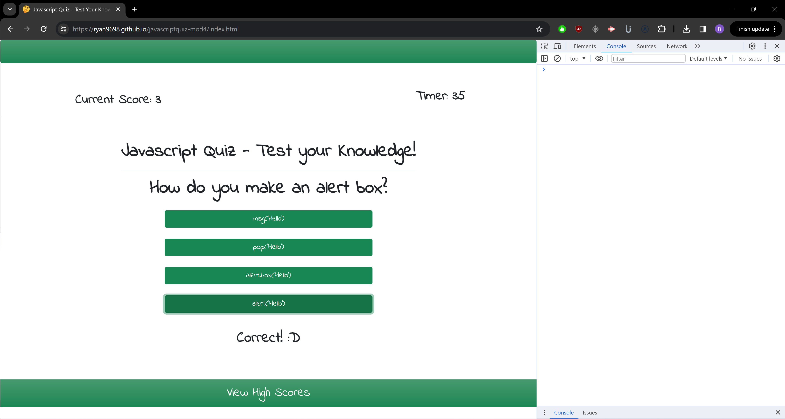
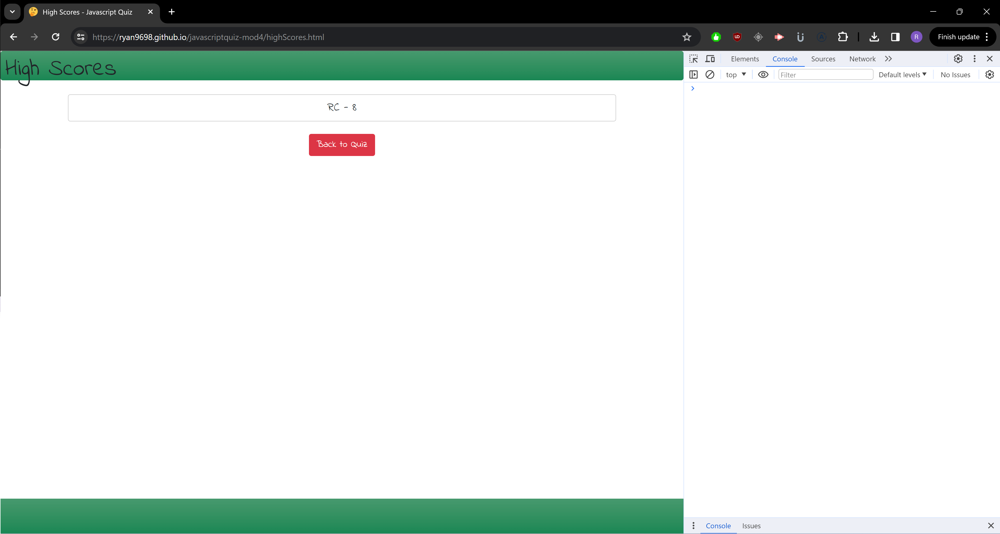

# Javascript Quiz - Module 4 Challenge

## Description

This quiz was designed to be a quiz to test a user's basic understanding of JavaScript. It was a cool experience because it was entirely coded from scratch and used vanilla JavaScript in a way we haven't worked with too often. While basic, I tried to add a couple different features to it to surpass the requirements such as utilizing local storage to render a list of high scores on a separate html file so a user can see if they have improved. At this time there are limited questions but it would be cool to go back and add more questions and features at a later date. I primarily learned a lot about styling through this assignment and the way to link files in different ways. Using node, you get used to module exports but I learned you can source several JavaScript files in your html file, allowing you to organize your code and keep script files from getting too large. I also learned how to incorporate dynamic features in a way I wasn't comfortable with, such as the timer and current score.

## Installation

N/A

## Usage

To use this web app, all you need to do is access the URL and click the "Begin Test" Button. The quiz will initialize immediate and the timer will begin to count down. You just answer the questions and put your initials in at the end of the quiz and it'll redirect you to the high scores page where it will show you a list of high scores.

## Contributors

No other contributors for this project.

## License

This project does not have a license.

## Questions

If you have any questions, you can see my GitHub portfolio at [Ryan9698](https://github.com/Ryan9698) or reach me by email at rcaltabiano90@gmail.com.

## Link

[GitHub_Pages](https://ryan9698.github.io/javascriptquiz-mod4/)

## Screenshots

